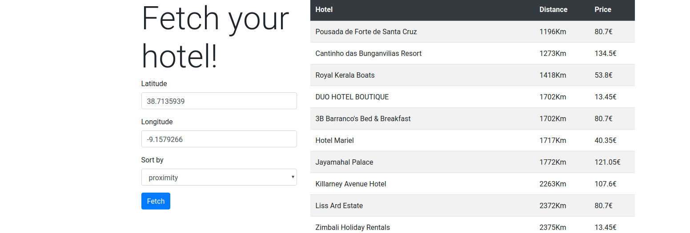

# Fetch for me

This is a test project to retrieve data from a webservice, based on the wanted coordinates, and display it.

## Installation

**Note**: This README assumes that you have [Docker](https://docs.docker.com/install/linux/docker-ce/ubuntu/) and [Docker Composer](https://docs.docker.com/compose/install/) installed.

Clone the repository to wherever you want:

```bash
git clone https://github.com/devaneando/fetchForMe.git ~/fetchForMe
```

Add the API data to the environment files

```bash
cd ~/fetchForMe/symfony
cp .env .env.local
cp .env .env.test.local
cp phpunit.xml.dist phpunit.xml
```

In the previously created filed, fill the `API_URL` and the `API_KEY` values.

Build the images and start the containers

```bash
cd ~/fetchForMe
sudo docker-compose build
sudo docker-compose up
```

Find the container id of the php container

```bash
sudo docker ps
$ CONTAINER ID        IMAGE               COMMAND                  CREATED             STATUS              PORTS                           NAMES
$ af920e021b73        fetchforme_apache   "/bin/sh -c 'apachec…"   5 minutes ago       Up 5 minutes        443/tcp, 0.0.0.0:8080->80/tcp   sf4_apache
$ de08bd53bbd7        fetchforme_php      "docker-php-entrypoi…"   5 minutes ago       Up 5 minutes        9000/tcp                        sf4_php
```

Download the vendors

```bash
sudo docker exec -it -u dev de08bd53bbd7 composer install
```

You should be able to access the application in the <http://localhost:8080> url.

If some problem happens, please try to clear the caches.

```bash
docker exec -it -u dev de08bd53bbd7 bin/console cache:clear
```

## Web interface



The web interface will ask you to give permission to access the browser location. If you do, your coordinates will be automatically filled for you.

If you want, you may sort the hotels by distance and by price.

The hotel list will be displayed after you hit the Fetch button.

## Api

You may access the api through a GET request in the following URLS:

- <http://localhost:8080/search/nearby-hotels/{latitude}/{longitude}>
- <http://localhost:8080/search/nearby-hotels/{latitude}/{longitude}/{orderBy}>

Where:

- **{latitude}** is your latitude, ex.: 38.7135939
- **{longitude}** is your longitude, ex.: -9.1579266
- **{orderBy}** is your is the type of sorting you want. It may be `price` and `proximity`.

## Services

`App\Service\SearchService` is responsible for the fetch logic. It implements the required `Search::getNearbyHotels` logic.

`App\Controller\FetchHotelController` renders the views and the API results.
